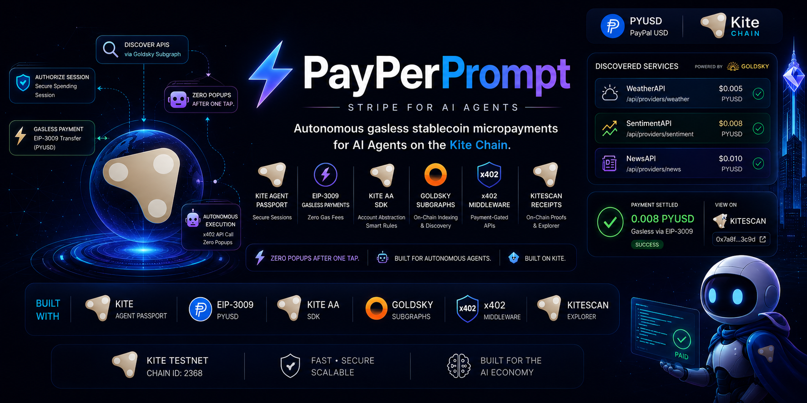
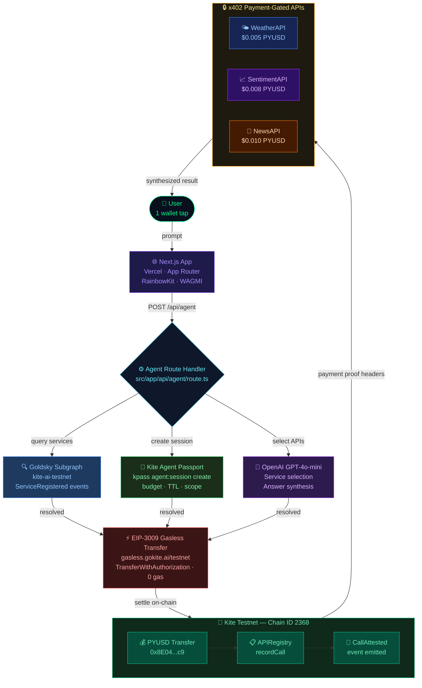

# ⚡ PayPerPrompt — Stripe for AI Agents

<div align="center">



**The first API marketplace where autonomous agents discover, pay, and execute in one atomic on-chain flow.**

[](https://payperprompt.nikhilraikwar.me)
[](https://testnet.kitescan.ai)
[](#)
[](#)

</div>

---

## 🚀 What is PayPerPrompt?

PayPerPrompt is **"Stripe for AI Agents"** — a production-grade autonomous agent execution layer built on every Kite primitive:

- AI agents **discover** on-chain registered API services via **Goldsky subgraph**
- **Gasless micropayments** in PYUSD via **EIP-3009**, routed through `gasless.gokite.ai`
- **Kite Agent Passport** spending sessions scope exactly what the agent can spend
- **AA SDK** (`gokite-aa-sdk`) enforces on-chain budget rules via ClientAgentVault
- **On-chain attestations** — every API call permanently recorded via `APIRegistry.recordCall()`
- **Zero popups** after a single passkey/wallet approval — fully autonomous within session

---

## 🏗️ Architecture



---

## 🔑 Full Kite Integration Details

### 1. EIP-3009 Gasless Payments (`src/lib/gasless.ts`)

Implements exactly per [Kite Gasless Docs](https://docs.gokite.ai/kite-chain/9-gasless-integration):

```typescript
// 1. Fetch live token metadata
GET https://gasless.gokite.ai/supported_tokens
// → eip712_name: "PYUSD", eip712_version: "1", decimals: 18

// 2. Sign EIP-712 TypedData (TransferWithAuthorization)
// validBefore = nowTs + 25n  ← within 30s max required by Kite docs

// 3. POST to relayer
POST https://gasless.gokite.ai/testnet
// Body: { from, to, value, validAfter, validBefore, tokenAddress, nonce, v, r, s }
// → { txHash: "0x..." }
```

### 2. AA SDK — ClientAgentVault (`src/lib/kite-aa.ts`)

Implements per [Kite AA SDK Docs](https://docs.gokite.ai/kite-chain/account-abstraction-sdk):

```typescript
import { GokiteAASDK } from 'gokite-aa-sdk';

const sdk = new GokiteAASDK(
  'kite_testnet',
  'https://rpc-testnet.gokite.ai',
  'https://bundler-service.staging.gokite.ai/rpc/'
);

// Spending rules on ClientAgentVault
const rules = [{
  timeWindow: 3600n,
  budget: ethers.parseUnits('1', 18),
  initialWindowStartTime: BigInt(Math.floor(Date.now() / 1000)),
  targetProviders: [PROVIDER_WALLET]
}];
```

**Testnet Addresses:**

| Contract | Address |
|---|---|
| Settlement Token | `0x0fF5393387ad2f9f691FD6Fd28e07E3969e27e63` |
| ClientAgentVault Impl | `0xB5AAFCC6DD4DFc2B80fb8BCcf406E1a2Fd559e23` |
| Settlement Contract | `0x8d9FaD78d5Ce247aA01C140798B9558fd64a63E3` |

### 3. Agent Passport — Spending Sessions (`src/lib/passport.ts`)

Per [Kite Agent Passport Docs](https://docs.gokite.ai/kite-agent-passport/kite-agent-passport) and [CLI Reference](https://docs.gokite.ai/kite-agent-passport/cli-reference), the full real-world Passport flow:

```bash
# Step 1: Install Passport tools into your agent environment
curl -fsSL https://agentpassport.ai/install.sh | bash

# Step 2: Register your agent (one-time)
kpass agent:register --type coding-assistant --output json
# → { agentId: "agent_abc123", type: "coding-assistant" }

# Step 3: Create a scoped spending session
kpass agent:session create \
  --task-summary "Execute API calls via PayPerPrompt marketplace" \
  --max-amount-per-tx 0.01 \
  --max-total-amount 1.00 \
  --ttl 1h \
  --assets USDC \
  --payment-approach x402_http \
  --output json
# → { requestId: "req_...", status: "pending_approval" }

# Step 4: User approves with passkey (device fingerprint/Face ID)
kpass agent:session status \
  --request-id <REQUEST_ID> \
  --wait \
  --output json
# → { status: "approved", sessionId: "sess_..." }

# Step 5: Agent executes paid API calls autonomously within budget
kpass agent:session execute \
  --url "https://payperprompt.nikhilraikwar.me/api/providers/weather?city=Bhopal" \
  --method GET \
  --output json
# → { data: { city: "Bhopal", temp: "33°C", ... }, txHash: "0x..." }
```

In the web app (`src/lib/passport.ts`), this is implemented as a **Vercel-safe REST session manager** — same budget/TTL enforcement, no `execSync` subprocess calls that would fail in serverless. The `validateSession()` function mirrors exactly what `kpass agent:session status` enforces before any spend.

### 4. x402 Payment-Gated Providers (`src/app/api/providers/`)

Implements per [Kite Service Provider Guide](https://docs.gokite.ai/kite-agent-passport/service-provider-guide):

```typescript
// Without payment headers → 402 with terms
{
  "error": "X-PAYMENT header is required",
  "accepts": [{
    "scheme": "gokite-aa",
    "network": "kite-testnet",
    "maxAmountRequired": "5000000000000000",   // 0.005 PYUSD in wei
    "asset": "0x8E04D099b1a8Dd20E6caD4b2Ab2B405B98242ec9",
    "payTo": "0x4a9B3AFCbdCb38420fE4cADb9Cf0257c282fe173",
    "x402Version": 1
  }]
}

// With x-payment-tx + x-payer-address headers:
// Service verifies Transfer event on Kite chain → returns data
```

### 5. Goldsky Subgraph (`goldsky/`)

Deployed per [Goldsky-Kite Integration Docs](https://docs.gokite.ai/kite-chain/11-goldsky-kite-integration):

```yaml
# goldsky/subgraph.yaml
network: kite-ai-testnet
source:
  address: "0x4a9B3AFCbdCb38420fE4cADb9Cf0257c282fe173"
eventHandlers:
  - event: ServiceRegistered(indexed uint256,address,string,uint256)
  - event: CallAttested(indexed uint256,address,bytes32,uint256)
```

**Live endpoint:** `https://api.goldsky.com/api/public/project_cmpauvflbxl4l01tgc2cgakep/subgraphs/payperprompt/1.0.0/gn`

---

## 📜 Kite Testnet Contract Addresses

| Contract | Address | Explorer |
|---|---|---|
| **PYUSD Token** | `0x8E04D099b1a8Dd20E6caD4b2Ab2B405B98242ec9` | [view ↗](https://testnet.kitescan.ai/address/0x8E04D099b1a8Dd20E6caD4b2Ab2B405B98242ec9) |
| **Service Registry** | `0x4a9B3AFCbdCb38420fE4cADb9Cf0257c282fe173` | [view ↗](https://testnet.kitescan.ai/address/0x4a9B3AFCbdCb38420fE4cADb9Cf0257c282fe173) |
| **Settlement Contract** | `0x8d9FaD78d5Ce247aA01C140798B9558fd64a63E3` | [view ↗](https://testnet.kitescan.ai/address/0x8d9FaD78d5Ce247aA01C140798B9558fd64a63E3) |
| **Settlement Token (AA)** | `0x0fF5393387ad2f9f691FD6Fd28e07E3969e27e63` | [view ↗](https://testnet.kitescan.ai/address/0x0fF5393387ad2f9f691FD6Fd28e07E3969e27e63) |
| **ClientAgentVault Impl** | `0xB5AAFCC6DD4DFc2B80fb8BCcf406E1a2Fd559e23` | [view ↗](https://testnet.kitescan.ai/address/0xB5AAFCC6DD4DFc2B80fb8BCcf406E1a2Fd559e23) |

---

## 🏃 Local Setup

### Prerequisites
Node.js v20+, npm

### 1. Clone & Install
```bash
git clone https://github.com/your-username/payperprompt
cd payperprompt
npm install --legacy-peer-deps
```

### 2. Environment Variables — `.env.local`
```bash
NEXT_PUBLIC_KITE_RPC=https://rpc-testnet.gokite.ai
NEXT_PUBLIC_CHAIN_ID=2368
NEXT_PUBLIC_EXPLORER=https://testnet.kitescan.ai
NEXT_PUBLIC_APP_URL=http://localhost:3000
NEXT_PUBLIC_REGISTRY_ADDRESS=0x4a9B3AFCbdCb38420fE4cADb9Cf0257c282fe173
NEXT_PUBLIC_GOLDSKY_URL=https://api.goldsky.com/api/public/project_cmpauvflbxl4l01tgc2cgakep/subgraphs/payperprompt/1.0.0/gn

# Optional — enables AI-powered service selection + answer synthesis
OPENAI_API_KEY=sk-...

# Optional — enables real server-side EIP-3009 gasless transfers
AGENT_PRIVATE_KEY=0x...
```

> **Demo mode works without any keys** — the app runs with simulated transactions.

### 3. Run
```bash
npm run dev
# Open http://localhost:3000
```

### 4. Get Testnet Funds
1. KITE gas → [faucet.gokite.ai](https://faucet.gokite.ai)
2. PYUSD → [KiteScan PYUSD contract](https://testnet.kitescan.ai/address/0x8E04D099b1a8Dd20E6caD4b2Ab2B405B98242ec9?tab=write_contract) → connect wallet → call `claim()`

### 5. Install Kite Passport (optional — for real passkey sessions)
```bash
curl -fsSL https://agentpassport.ai/install.sh | bash
kpass agent:register --type coding-assistant --output json
```

---

## 🛠️ Technology Stack

| Layer | Technology |
|---|---|
| Framework | Next.js 16, Turbopack, App Router, Vercel |
| Web3 | Ethers.js v6, WAGMI v3, RainbowKit v2, Viem |
| Payments | EIP-3009 `transferWithAuthorization` via `gasless.gokite.ai` |
| Identity | Kite Agent Passport (REST session model) |
| AA | `gokite-aa-sdk` — ClientAgentVault + spending rules |
| Indexer | Goldsky Subgraph on `kite-ai-testnet` |
| AI | OpenAI GPT-4o-mini |
| Contracts | Hardhat, Solidity 0.8.20, Kite Testnet |

---

## 📄 License

MIT — Copyright © 2026 Nikhil Raikwar
