# ⚡ PayPerPrompt — Stripe for AI Agents

> Autonomous gasless stablecoin micropayments for AI Agents executing on the Kite Chain. Built with the **Kite Agent Passport** protocol.

---

## 🚀 Overview

**PayPerPrompt** is a premium, high-performance developer dashboard and execution layer that acts as the **"Stripe for AI Agents"**. 

It enables AI Agents to discover registered API services, request secure spending sessions, authorize gasless micropayments in **PYUSD (PayPal USD)**, and execute operations autonomously — all with **exactly zero popups** after a single initial tap.

```mermaid
sequenceDiagram
    autonumber
    actor Human as User (Passkey Tap)
    participant Agent as AI Agent (Kite Passport)
    participant Registry as Service Registry
    participant PYUSD as PYUSD ERC-20
    participant Provider as API Service Provider
    
    Human->>Agent: Prompt: "Get today's ETH sentiment"
    Agent->>Registry: Search matching APIs (Goldsky)
    Registry-->>Agent: Discovers SentimentAPI ($0.008 PYUSD)
    Agent->>Human: Request spending session budget ($1.00)
    Human-->>Agent: Approves Session via Wallet Signature
    rect rgb(20, 30, 45)
        note right of Agent: Autonomous Loop (Zero Popups)
        Agent->>PYUSD: EIP-3009 Transfer (0.008 PYUSD)
        PYUSD-->>Provider: Settled Gaslessly on Kite Testnet
        Agent->>Provider: Call API Endpoint
        Provider-->>Agent: Returns sentiment: Bullish 78%
    end
    Agent->>Human: Formats final response with KiteScan Receipts!
```



---

## ✨ Features

- **⚡ Live On-Chain Wallet Signatures:** Initiates genuine **PYUSD ERC-20** micropayment transactions on the Kite Testnet directly from the user's browser wallet (MetaMask, RainbowKit).
- **🧠 Dynamic Agent Query Matching:** Automatically parses the user's natural language input, matching relevant API providers (e.g. `SentimentAPI`, `WeatherAPI`, `CryptoPriceAPI`) dynamically based on context.
- **🔐 Scoped Passport Spending Sessions:** Avoids transaction popup fatigue. Users authorize a one-time spending session with strict budget caps and specific scopes, allowing agents to transact autonomously in the background.
- **⛽ Gasless Stablecoin Transfers:** Implements the **EIP-3009 (`transferWithAuthorization`)** stablecoin standard, allowing transaction relayers to absorb gas costs and settle instantly in PYUSD.
- **🔍 Clickable Block Explorer Logs:** All dynamic transaction hashes generated during execution are fully hyperlinked directly to the live transaction page on **KiteScan** for instant auditable verification.
- **📱 100% Fluid Responsive Layouts:** Optimized for all viewports (Mobile, Tablet, Desktop) featuring a sliding navigation drawer, modern stats grid, and sleek dark neon themes.

---

## 🛠️ Technology Stack

- **Framework:** Next.js (Page Router, App Router)
- **Styling:** CSS variables, Vanilla CSS for premium 120Hz native animations, modern glassmorphism UI tokens.
- **Web3 Integration:** WAGMI hooks, Viem, RainbowKit.
- **Stablecoin Protocol:** EIP-3009 (PYUSD / USDC on Kite Testnet).
- **Block Explorer:** [KiteScan Testnet Explorer](https://testnet.kitescan.ai).

---

## 🏃 Local Setup & Development

### 1. Prerequisites
Ensure you have [Node.js](https://nodejs.org) (v18+) and `npm` installed.

### 2. Clone and Setup Environment Variables
Clone the repository, enter the directory, and duplicate the environment variables example:
```bash
cp .env.example .env.local
```
Open `.env.local` and configure your API keys (e.g., `OPENAI_API_KEY`, connected wallet credentials, and local host configurations).

### 3. Install Dependencies
```bash
npm install
```

### 4. Run Development Server
```bash
npm run dev
```
Open `http://localhost:3000` in your browser to view the application.

### 5. Build for Production
To optimize and validate compilation types:
```bash
npm run build
```

---

## 🚰 Faucet Information
If your connected wallet holds zero testnet PYUSD, you can claim free testnet tokens directly:
1. Navigate to the [KiteScan PYUSD Contract Page](https://testnet.kitescan.ai/address/0x8E04D099b1a8Dd20E6caD4b2Ab2B405B98242ec9?tab=write_contract).
2. Connect your wallet via the block explorer interface.
3. Call the public **`claim`** or **`claimTo`** method to receive free testnet PYUSD instantly.

---

## 📜 Smart Contracts

- **PYUSD ERC-20 Contract:** `0x8E04D099b1a8Dd20E6caD4b2Ab2B405B98242ec9`
- **Kite Service Registry Address:** `0x4a9B3AFCbdCb38420fE4cADb9Cf0257c282fe173`
- **Micropayment Settlement Contract:** `0x8d9FaD78d5Ce247aA01C140798B9558fd64a63E3`

---

## 🤝 Contributing
Contributions are always welcome. Please open an issue or submit a pull request with any improvements or additional integrations.

---

## 📄 License
This project is licensed under the MIT License.
