# ⚡ PayPerPrompt — Stripe for AI Agents


> Autonomous gasless stablecoin micropayments for AI Agents executing on the Kite Chain. Built with the **Kite Agent Passport** protocol, **Account Abstraction**, **EIP-3009**, and indexed via **Goldsky**.

---

## 🚀 Overview

**PayPerPrompt** is a premium, high-performance developer dashboard and execution layer that acts as the **"Stripe for AI Agents"**. 

It enables AI Agents to discover registered API services on-chain via **Goldsky subgraphs**, request secure spending sessions, authorize gasless micropayments in **PYUSD (PayPal USD)**, and execute operations autonomously — all with **exactly zero popups** after a single initial tap.

```mermaid
sequenceDiagram
    autonumber
    actor Human as User (Passkey Tap)
    participant Agent as AI Agent (Kite Passport)
    participant Subgraph as Goldsky Subgraph
    participant Registry as Service Registry
    participant PYUSD as PYUSD ERC-20
    participant Provider as API Service Provider
    
    Human->>Agent: Prompt: "Get today's ETH sentiment and news"
    Agent->>Subgraph: Search matching APIs (Service Discovery)
    Subgraph-->>Agent: Discovers SentimentAPI ($0.008 PYUSD) & NewsAPI ($0.010 PYUSD)
    Agent->>Human: Request spending session budget ($1.00)
    Human-->>Agent: Approves Session via Wallet Signature
    rect rgb(20, 30, 45)
        note right of Agent: Autonomous Loop (Zero Popups)
        Agent->>PYUSD: EIP-3009 Transfer (0.008 PYUSD)
        PYUSD-->>Provider: Settled Gaslessly on Kite Testnet via Relayer
        Agent->>Provider: Call x402 API Endpoint with Payment Proof
        Provider-->>Agent: Returns sentiment: Bullish 78%
    end
    Agent->>Human: Formats final response with KiteScan Receipts!
```



---

## ✨ Features

- **🛡️ REST-Based Passport Spending Sessions:** Built a Vercel-safe spending session manager that completely bypasses serverless-incompatible CLI `execSync` commands. Scopes and limits are mathematically enforced via session budgets.
- **⚡ EIP-3009 Gasless Payments:** Fully integrated the **EIP-3009 (`transferWithAuthorization`)** stablecoin standard. Agents cryptographically sign transactions using their private key and POST the signature directly to `gasless.gokite.ai/testnet`, resulting in **zero native gas fees**.
- **⛓️ Account Abstraction (AA) Smart Rules:** Integrates `gokite-aa-sdk` to manage upgrades, deploy upgradeable agent vaults (`ClientAgentVault` proxies), configure hardcoded spending budgets/time-windows, and secure funds.
- **🔍 Goldsky Subgraph Indexer:** Real-world service discovery powered by a custom **Goldsky Subgraph** deployed to `kite-ai-testnet` (`payperprompt/1.0.0`). Dynamically indexes `ServiceRegistered` and `CallAttested` events for decentralized, low-latency API tracking.
- **🔒 x402 Payment-Gated Middleware:** Implements three live HTTP 402 endpoints following the open x402 specification:
  - 🌦️ **WeatherAPI** (`/api/providers/weather`) - $0.005 PYUSD
  - 📈 **SentimentAPI** (`/api/providers/sentiment`) - $0.008 PYUSD
  - 📰 **NewsAPI** (`/api/providers/news`) - $0.010 PYUSD
  Endpoints return structured schemas and verify on-chain PYUSD payment transactions in real-time.
- **⛽ Live Block Explorer Logs:** Every on-chain attestation and gasless payment is hyperlinked to **KiteScan** for instant auditable confirmation.

---

## 🛠️ Technology Stack

- **Framework:** Next.js (Turbopack, App Router)
- **Styling:** CSS variables, Vanilla CSS for premium native glassmorphic animations.
- **Web3 Integration:** Ethers.js v6, WAGMI hooks, RainbowKit, Viem.
- **Account Abstraction:** `gokite-aa-sdk`
- **Stablecoin Protocol:** EIP-3009 (PYUSD / USDC on Kite Testnet).
- **On-chain Indexer:** Goldsky Subgraph (kite-ai-testnet).
- **Block Explorer:** [KiteScan Testnet Explorer](https://testnet.kitescan.ai).

---

## 📜 Kite Testnet Network Info & Addresses

- **Network Chain ID:** `2368`
- **Network RPC:** `https://rpc-testnet.gokite.ai`
- **PYUSD Token Address:** `0x8E04D099b1a8Dd20E6caD4b2Ab2B405B98242ec9`
- **Kite Service Registry:** `0x4a9B3AFCbdCb38420fE4cADb9Cf0257c282fe173`
- **Settlement Contract:** `0x8d9FaD78d5Ce247aA01C140798B9558fd64a63E3`
- **ClientAgentVault Proxy Impl:** `0xB5AAFCC6DD4DFc2B80fb8BCcf406E1a2Fd559e23`
- **Goldsky Query Endpoint:** `https://api.goldsky.com/api/public/project_cmpauvflbxl4l01tgc2cgakep/subgraphs/payperprompt/1.0.0/gn`

---

## 🏃 Local Setup & Development

### 1. Prerequisites
Ensure you have [Node.js](https://nodejs.org) (v20+) and `npm` installed.

### 2. Clone and Setup Environment Variables
Clone the repository and set up your `.env.local` using the keys:
```bash
NEXT_PUBLIC_KITE_RPC=https://rpc-testnet.gokite.ai
NEXT_PUBLIC_CHAIN_ID=2368
NEXT_PUBLIC_EXPLORER=https://testnet.kitescan.ai
NEXT_PUBLIC_APP_URL=http://localhost:3000
NEXT_PUBLIC_REGISTRY_ADDRESS=0x4a9B3AFCbdCb38420fE4cADb9Cf0257c282fe173
NEXT_PUBLIC_GOLDSKY_URL=https://api.goldsky.com/api/public/project_cmpauvflbxl4l01tgc2cgakep/subgraphs/payperprompt/1.0.0/gn
AGENT_PRIVATE_KEY=0x...
OPENAI_API_KEY=sk-...
```

### 3. Install Dependencies
```bash
npm install
```

### 4. Run Development Server
```bash
npm run dev
```
Open `http://localhost:3000` to interact with the premium agent execution console.

### 5. Build for Production
Validation compile check:
```bash
npm run build
```

---

## 🛰️ Subgraph Setup (Goldsky)
The Goldsky Subgraph is already fully configured in `goldsky/subgraph.yaml`, mapping `APIRegistry.sol` events to structured GraphQL storage.
- To deploy a fresh version manually:
  ```powershell
  npm i -g @goldskycom/cli
  goldsky login
  # Use Goldsky Web UI or CLI to deploy instant subgraph from APIRegistry.json ABI
  ```

---

## 🚰 Faucet Information
If your agent wallet needs testnet PYUSD:
1. Navigate to the [KiteScan PYUSD Contract Page](https://testnet.kitescan.ai/address/0x8E04D099b1a8Dd20E6caD4b2Ab2B405B98242ec9?tab=write_contract).
2. Connect your wallet under "Write Contract".
3. Invoke the public **`claim`** method to receive free testnet PYUSD instantly.
4. Get testnet KITE gas from the [Faucet](https://faucet.gokite.ai) if configuring AA rules directly.

---

## 📄 License
This project is licensed under the MIT License.
